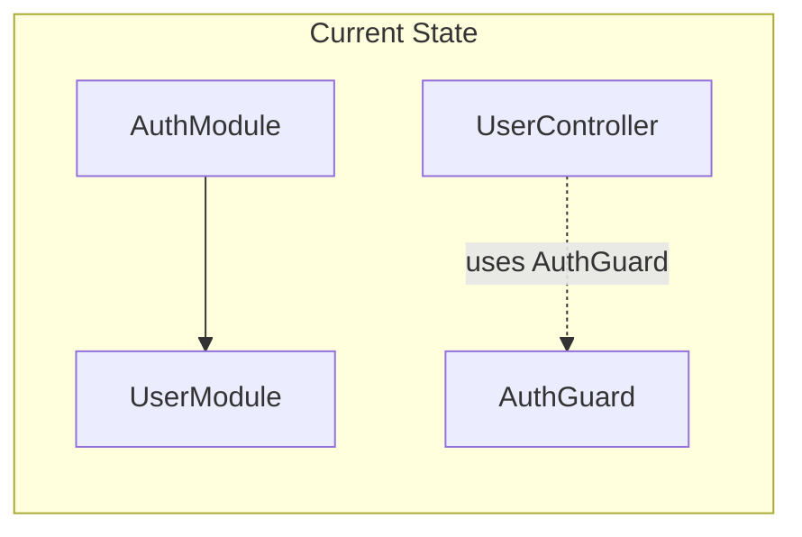
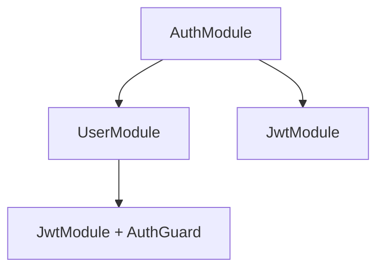

# Circular Dependency Analysis: Auth & User Modules

## Current Dependency Graph



**Module-level imports:**

- [auth.module.ts](src/auth/auth.module.ts): `AuthModule` imports `UserModule` (line 4, 10)
- [user.module.ts](src/user/user.module.ts): `UserModule` does **not** import `AuthModule`

**File-level imports:**

- [auth.service.ts](src/auth/auth.service.ts): Imports and injects `UserRepository` from `src/user/user.repository`
- [user.controller.ts](src/user/user.controller.ts): Imports `AuthGuard` from `src/auth/guard/auth.guard` (line 3) and uses `@UseGuards(AuthGuard)` (line 16)

---

## Does a Circular Dependency Exist?

**Currently: No active circular dependency** at the module level, because `UserModule` does not import `AuthModule`.

However:

1. **Latent circular dependency:** To correctly use `AuthGuard` in `UserController`, `AuthGuard` must be a provider with access to `JwtService` and `ConfigService`. The natural approach is to add `AuthGuard` to `AuthModule` and have `UserModule` import `AuthModule`, which would create:
   ```
   AuthModule → UserModule → AuthModule (circular)
   ```

2. **AuthGuard not registered:** `AuthGuard` is not in any module’s `providers`, so the `/user` route will likely fail when `AuthGuard` tries to inject `JwtService` and `ConfigService`.

---

## Recommended Folder Structure to Avoid Circular Dependencies

Use a shared/common module for guards and other cross-cutting concerns. Both `AuthModule` and `UserModule` depend on it, but it does not depend on either.

### Option A: Dedicated Guards/Common Module (recommended)

```
src/
├── common/                      # Shared cross-cutting concerns
│   ├── guards/
│   │   └── auth.guard.ts       # Move from auth/guard/
│   ├── common.module.ts        # Exports AuthGuard, imports JwtModule
│   └── index.ts                # Barrel exports
├── auth/
│   ├── auth.module.ts          # Imports UserModule, JwtModule (no guard export)
│   └── ...
├── user/
│   ├── user.module.ts          # Imports CommonModule (for AuthGuard)
│   └── ...
```

**Dependency flow:**



No cycles: `AuthModule → UserModule`, `UserModule → CommonModule`.

### Option B: Shared Auth/Guards Module

If you prefer a more explicit “auth” shared layer:

```
src/
├── shared/
│   └── guards/
│       ├── auth.guard.ts
│       └── guards.module.ts    # Provides AuthGuard, imports JwtModule
├── auth/
├── user/
```

Same idea: guards live in a shared module that both feature modules import.

---

## Implementation Summary

| Action | File | Change |

|--------|------|--------|

| Create shared module | `src/common/guards/auth.guard.ts` | Move from `src/auth/guard/auth.guard.ts` |

| Create module | `src/common/common.module.ts` | Provide `AuthGuard`, import `JwtModule.registerAsync()` or `JwtModule` |

| Update | `src/user/user.module.ts` | Import `CommonModule` instead of (or before) `AuthModule` |

| Update | `src/user/user.controller.ts` | Import `AuthGuard` from `common/guards/` |

| Update | `src/auth/auth.module.ts` | Remove guard-related logic if it was there; keep `UserModule` + `JwtModule` |

| Remove | `src/auth/guard/` | Delete if empty after moving `auth.guard.ts` |

---

## Alternative: `forwardRef` (Not Recommended)

You can resolve cycles with `forwardRef()`:

```typescript
// user.module.ts
imports: [forwardRef(() => AuthModule)]

// auth.module.ts  
imports: [forwardRef(() => UserModule)]
```

This works but hides design problems and can lead to subtle runtime issues. Prefer restructuring over `forwardRef`.

---

## Key Principle

Avoid cycles by introducing a **shared module** (e.g. `CommonModule` or `GuardsModule`) that holds cross-cutting pieces (like `AuthGuard`) and that does not depend on feature modules such as `AuthModule` or `UserModule`.